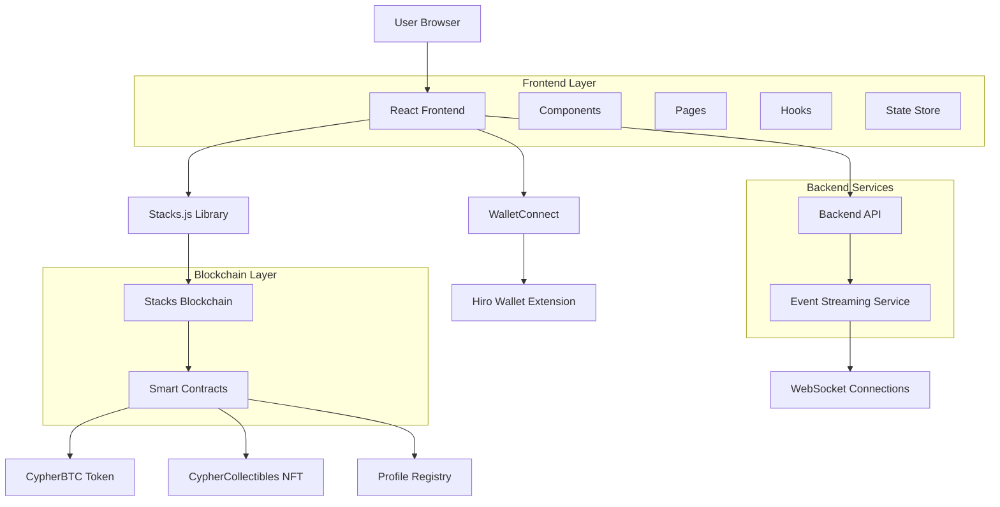
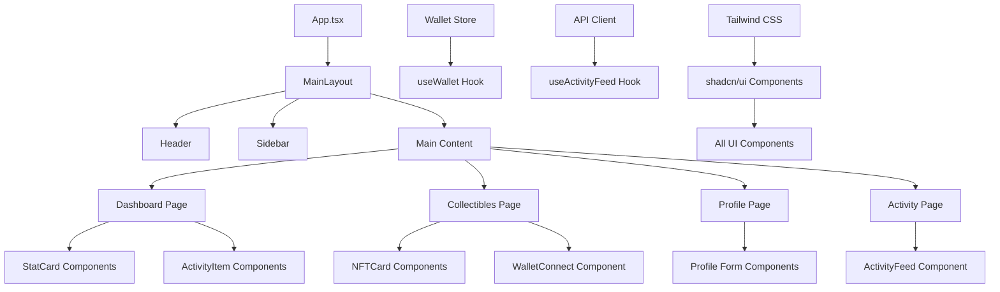
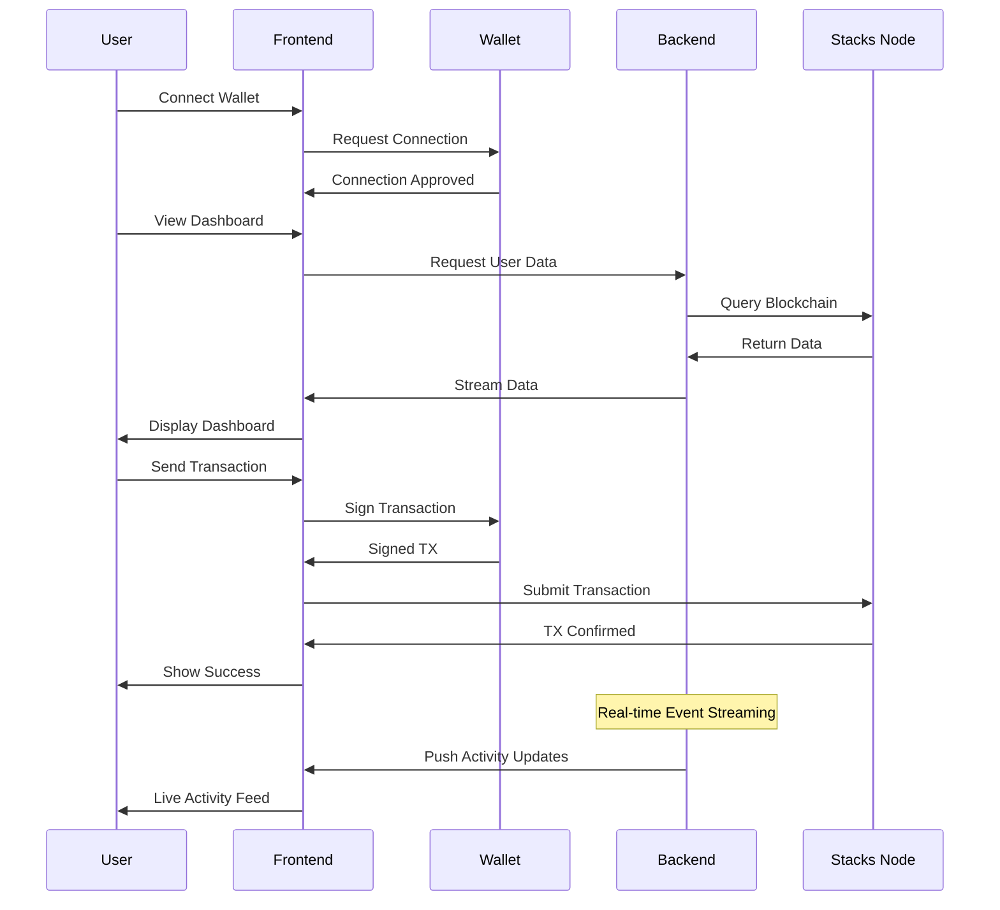
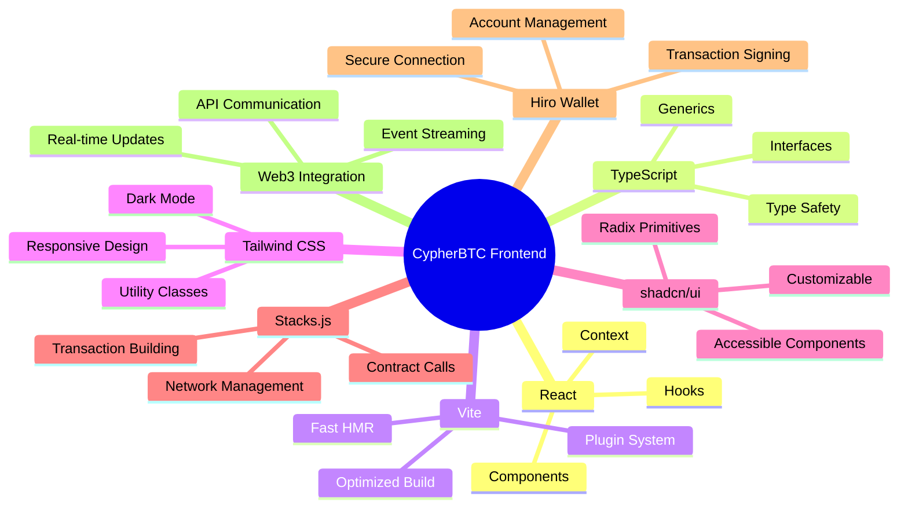

# CypherBTC Frontend

[](https://opensource.org/licenses/MIT)
[](https://www.typescriptlang.org/)
[](https://reactjs.org/)
[](https://vitejs.dev/)
[](https://tailwindcss.com/)

> A decentralized application (dApp) frontend for the Stacks blockchain ecosystem

CypherBTC Frontend is a modern React-based dApp that provides seamless interaction with the Stacks blockchain, enabling users to manage CypherBTC tokens, NFT collectibles, and on-chain profiles through an intuitive web interface powered by Hiro Wallet integration and real-time activity feeds.

## Table of Contents

- [Features](#features)
- [Architecture](#architecture)
- [Technologies](#technologies)
- [Prerequisites](#prerequisites)
- [Installation](#installation)
- [Configuration](#configuration)
- [Usage](#usage)
- [Development](#development)
- [Testing](#testing)
- [Deployment](#deployment)
- [Contributing](#contributing)
- [Code of Conduct](#code-of-conduct)
- [Security](#security)
- [Support](#support)
- [Roadmap](#roadmap)
- [License](#license)
- [Acknowledgments](#acknowledgments)

## Features

### Core Functionality
- 🔐 **Secure Wallet Integration** - Connect Hiro Wallet for authenticated blockchain interactions
- 💰 **cBTC Token Management** - View balances, send/receive CypherBTC tokens
- 🎨 **NFT Collectibles** - Browse, trade, and manage CypherCollectibles NFTs
- 👤 **On-chain Profiles** - Create and update decentralized identity profiles
- 📊 **Live Activity Feed** - Real-time blockchain activity streaming and notifications

### User Experience
- 📱 **Responsive Design** - Optimized for desktop, tablet, and mobile devices
- 🎯 **Intuitive UI** - Clean, modern interface built with shadcn/ui components
- ⚡ **Fast Performance** - Optimized with Vite for rapid loading and interactions
- 🌙 **Dark/Light Mode** - Theme switching for user preference
- 🔄 **Real-time Updates** - Live data synchronization with blockchain state

### Developer Experience
- 🛠️ **TypeScript** - Full type safety and enhanced IDE support
- 🧪 **Comprehensive Testing** - Unit and integration test coverage
- 📚 **Well-documented** - Extensive inline documentation and API references
- 🚀 **CI/CD Ready** - Automated testing and deployment pipelines

## Architecture

### System Architecture Overview



### Component Architecture



### Data Flow Architecture



### Key Components

- **Frontend Layer**: React application with TypeScript providing the user interface
- **State Management**: Centralized Zustand store for wallet connections and app state
- **Blockchain Integration**: Stacks.js library handling all blockchain interactions
- **Real-time Data**: WebSocket connections for live activity feed updates
- **UI Components**: Reusable component library built with Tailwind CSS and shadcn/ui
- **Wallet Integration**: Hiro Wallet connection for secure blockchain transactions
- **API Layer**: RESTful API client for backend service communication

### Technology Stack Architecture



## Technologies

### Core Framework
- **React 18** - Modern UI library with hooks and concurrent features
- **TypeScript 5** - Type-safe JavaScript with advanced type features
- **Vite 5** - Next-generation frontend tooling for fast development

### Styling & UI
- **Tailwind CSS** - Utility-first CSS framework
- **shadcn/ui** - High-quality, accessible component primitives
- **Radix UI** - Unstyled, accessible UI primitives

### Blockchain Integration
- **Stacks.js** - Official JavaScript library for Stacks blockchain
- **Hiro Wallet** - Browser extension for Stacks ecosystem
- **@stacks/connect** - Wallet connection and transaction signing

### Development Tools
- **ESLint** - Code linting and formatting
- **PostCSS** - CSS processing and optimization
- **Autoprefixer** - CSS vendor prefixing

## Prerequisites

Before you begin, ensure you have the following installed:

- **Node.js** >= 18.0.0
- **npm** >= 9.0.0 or **yarn** >= 1.22.0
- **Git** >= 2.30.0
- **Hiro Wallet** browser extension

### System Requirements
- **RAM**: Minimum 4GB, Recommended 8GB+
- **Storage**: 500MB free space
- **OS**: Windows 10+, macOS 10.15+, Linux (Ubuntu 18.04+)

## Installation

### Clone the Repository

```bash
git clone https://github.com/your-org/cypherbtc-frontend.git
cd cypherbtc-frontend
```

### Install Dependencies

```bash
# Using npm
npm install

# Using yarn
yarn install

# Using pnpm
pnpm install
```

### Environment Setup

1. Copy the environment template:
   ```bash
   cp .env.example .env.local
   ```

2. Configure your environment variables:
   ```bash
   # Edit .env.local with your configuration
   nano .env.local
   ```

## Configuration

### Environment Variables

| Variable | Description | Default |
|----------|-------------|---------|
| `VITE_STACKS_NETWORK` | Stacks network (mainnet/testnet) | testnet |
| `VITE_API_BASE_URL` | Backend API base URL | http://localhost:3001 |
| `VITE_APP_NAME` | Application display name | CypherBTC Frontend |
| `VITE_APP_VERSION` | Application version | 1.0.0 |

### Network Configuration

The application supports multiple Stacks networks:

- **Mainnet**: Production Stacks blockchain
- **Testnet**: Development and testing network
- **Devnet**: Local development network

## Usage

### Quick Start

1. **Start the development server**:
   ```bash
   npm run dev
   ```

2. **Open your browser** to `http://localhost:8080`

3. **Connect your wallet**:
   - Click "Connect Wallet" in the top navigation
   - Select Hiro Wallet from the popup
   - Approve the connection in your wallet extension

4. **Explore the dApp**:
   - View your dashboard with cBTC balance
   - Browse NFT collectibles
   - Update your on-chain profile
   - Monitor activity feed

### User Guide

For detailed usage instructions, see our [User Guide](./docs/user-guide.md).

## Development

### Development Scripts

```bash
# Start development server
npm run dev

# Build for production
npm run build

# Preview production build
npm run preview

# Run linter
npm run lint

# Fix linting issues
npm run lint:fix

# Type checking
npm run type-check
```

### Project Structure

```
src/
├── components/          # Reusable UI components
│   ├── layout/         # Layout components
│   ├── ui/             # Base UI components
│   └── forms/          # Form components
├── pages/              # Page components
│   ├── Dashboard.tsx
│   ├── Collectibles.tsx
│   └── Profile.tsx
├── hooks/              # Custom React hooks
│   ├── useWallet.ts
│   └── useActivityFeed.ts
├── lib/                # Utility functions
│   ├── api.ts          # API client
│   ├── constants.ts    # App constants
│   ├── stacks.ts       # Stacks utilities
│   └── utils.ts        # General utilities
├── store/              # State management
│   └── walletStore.ts  # Wallet state
├── types/              # TypeScript type definitions
└── main.tsx            # Application entry point
```

### Code Style

This project follows:
- [TypeScript Style Guide](https://github.com/microsoft/TypeScript/wiki/Coding-guidelines)
- [React Best Practices](https://react.dev/learn/thinking-in-react)
- [Conventional Commits](https://conventionalcommits.org/)

## Testing

### Running Tests

```bash
# Run all tests
npm test

# Run tests in watch mode
npm run test:watch

# Run tests with coverage
npm run test:coverage

# Run e2e tests
npm run test:e2e
```

### Test Structure

```
__tests__/
├── unit/               # Unit tests
├── integration/        # Integration tests
└── e2e/                # End-to-end tests
```

## Deployment

### Build for Production

```bash
npm run build
```

The built files will be in the `dist/` directory.

### Deployment Options

- **Vercel**: Connect your GitHub repo for automatic deployments
- **Netlify**: Drag & drop the `dist/` folder or connect via Git
- **GitHub Pages**: Use GitHub Actions for automated deployment
- **Self-hosted**: Serve the `dist/` folder with any static server

### Environment Configuration

Ensure your deployment platform has the correct environment variables set.

## Contributing

We welcome contributions! Please see our [Contributing Guide](./CONTRIBUTING.md) for details.

### Development Workflow

1. Fork the repository
2. Create a feature branch: `git checkout -b feature/your-feature-name`
3. Make your changes and add tests
4. Ensure all tests pass: `npm test`
5. Commit your changes: `git commit -m 'feat: add new feature'`
6. Push to your branch: `git push origin feature/your-feature-name`
7. Create a Pull Request

### Commit Convention

We follow [Conventional Commits](https://conventionalcommits.org/):

- `feat:` - New features
- `fix:` - Bug fixes
- `docs:` - Documentation changes
- `style:` - Code style changes
- `refactor:` - Code refactoring
- `test:` - Adding or updating tests
- `chore:` - Maintenance tasks

## Code of Conduct

This project adheres to a [Code of Conduct](./CODE_OF_CONDUCT.md). By participating, you are expected to uphold this code.

## Security

### Reporting Security Issues

If you discover a security vulnerability, please report it to security@cypherbtc.com instead of creating a public issue.

### Security Best Practices

- Never commit sensitive information (API keys, private keys, etc.)
- Use environment variables for configuration
- Keep dependencies updated
- Follow the principle of least privilege

For more information, see our [Security Policy](./SECURITY.md).

## Support

### Getting Help

- 📖 **Documentation**: [docs.cypherbtc.com](https://docs.cypherbtc.com)
- 💬 **Community Forum**: [forum.cypherbtc.com](https://forum.cypherbtc.com)
- 🐛 **Bug Reports**: [GitHub Issues](https://github.com/your-org/cypherbtc-frontend/issues)
- 💡 **Feature Requests**: [GitHub Discussions](https://github.com/your-org/cypherbtc-frontend/discussions)

### Community

- **Discord**: [Join our Discord](https://discord.gg/cypherbtc)
- **Twitter**: [@CypherBTC](https://twitter.com/CypherBTC)
- **Blog**: [blog.cypherbtc.com](https://blog.cypherbtc.com)

## Roadmap

### Version 1.1.0 (Q1 2026)
- [ ] Multi-wallet support
- [ ] Advanced NFT trading features
- [ ] Mobile app release

### Version 1.2.0 (Q2 2026)
- [ ] DeFi integration
- [ ] Cross-chain functionality
- [ ] Enhanced analytics dashboard

### Future Releases
- [ ] DAO governance features
- [ ] Advanced privacy features
- [ ] Institutional wallet support

See our [Roadmap](./ROADMAP.md) for detailed plans.

## License

This project is licensed under the MIT License - see the [LICENSE](./LICENSE) file for details.

## Acknowledgments

- **Stacks Foundation** for the Stacks blockchain ecosystem
- **Hiro Systems** for wallet infrastructure
- **shadcn** for the amazing UI component library
- **Our amazing contributors** for their valuable contributions

---

<p align="center">Made with ❤️ by the CypherBTC team</p>
